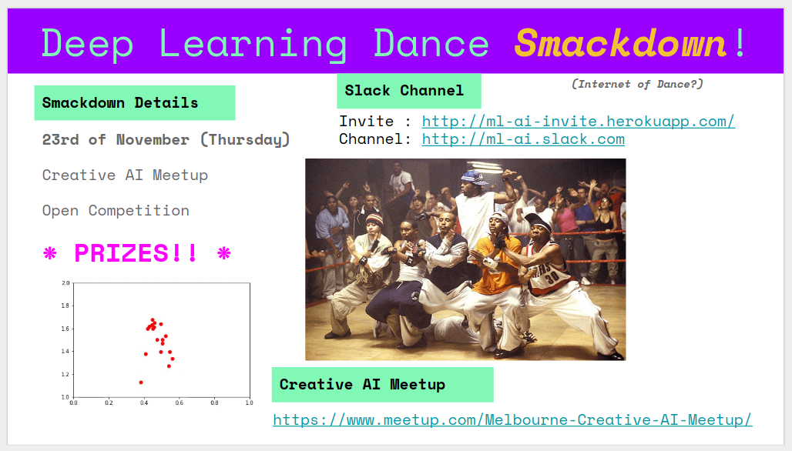

For the final event of the Melbourne Creative AI meetup this year I thought
we'd run a small, fun, competition - a _deep learning dance **smackdown**_.

The event details are on [Meetup](https://www.meetup.com/Melbourne-Creative-AI-Meetup/events/242805964/).

### Idea

The basic idea is, build a program that (does something like):

1. Watches a dance,
2. _and then_, Responds with a dance.

The exact format is flexible; some options would be:

1. Watch a video, learn the poses, respond with a dance,
2. Listen to audio, learn how to dance to the beat,
3. Watch a bunch of dances in joint/pose format, and then respond with dances in this same format,
4. Something else!

You may like to use:

- GANs (See
        [this](https://github.com/hwalsuklee/tensorflow-generative-model-collections) great list for a recent collection of GANs),
- Sequence models ([tensor2tensor](https://github.com/tensorflow/tensor2tensor),
 [seq2seq](https://www.tensorflow.org/tutorials/seq2seq), ...)
- Ready-made model
([human-motion-prediction](https://github.com/una-dinosauria/human-motion-prediction), ...)
- Something crazy!

The format on the night will simply be to show how your particular idea works.
It could be interactive, it could be online, it could be a presentation, it
could be embodied in an robot! I leave it to your imagination.

### Prize!

The prize on the night will be one of the Evolution of Dance T-Shirts:

### Pre-existing and related work

- [Nonlinear dance motion analysis and motion editing using Hilbert-Huang
  transform](https://scirate.com/arxiv/1707.01732)
- [Creative Robot Dance with Variational Encoder](https://scirate.com/arxiv/1707.01489)
- [Dance Dance Convolution](https://scirate.com/arxiv/1703.06891)
- [Exploring Implicit Human Responses to Robot Mistakes in a Learning from
   Demonstration Task](https://scirate.com/arxiv/1606.02485)
- [Generative Choreography using Deep Learning](https://scirate.com/arxiv/1605.06921)
- [Movement Coordination in Human-Robot Teams: A Dynamical Systems
  Approach](https://scirate.com/arxiv/1605.01459)
- [Free-body Gesture Tracking and Augmented Reality Improvisation for Floor and
  Aerial Dance](https://scirate.com/arxiv/1509.04751)
- [The Control Theory of Motion-Based Communication: Problems in Teaching
  Robots to Dance](https://scirate.com/arxiv/1109.6037)
- [Let Us Dance Just a Little Bit More --- On the Information Capacity of the
  Human Motor System](https://scirate.com/arxiv/1102.5225)
- [Semantic Modeling and Retrieval of Dance Video Annotations](https://scirate.com/arxiv/1001.0441)
- [Modeling and Annotating the Expressive Semantics of Dance Videos](https://scirate.com/arxiv/1001.0442)
- [Tutoring System for Dance Learning](https://scirate.com/arxiv/1001.0440)

### How to join ... !

If you want to participate, then just send me an [email](/about.html), or
just come along on the night with something to show!

### Keep in mind ...

The Three Laws of Robotic Dancing (courtesy of [andyg](https://www.linkedin.com/in/geekscape/?ppe=1))

1) A dance robot may not out-dance a human being or, through dance, allow a
   human being to be embarrassed.
2) A dance robot must complement the movements given it by human beings except
   where such dance moves would conflict with the First Law or good taste.
3) A dance robot must protect its own existence as long as such protection
   does not conflict with the First or Second Laws and the conservation of
   angular momentum.

